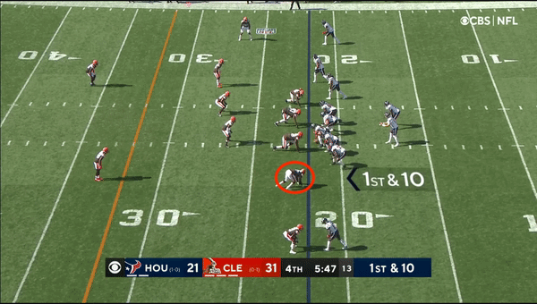
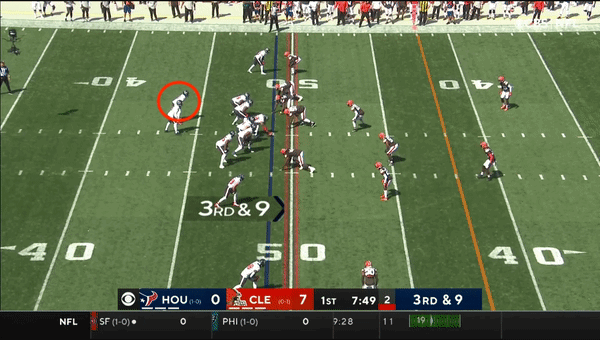

```{r setup, include=FALSE}
knitr::opts_chunk$set(echo = TRUE)
library(tidyverse)
library(gganimate)
library(ggplot2)
library(cowplot)
library(repr)
```

# Examples Plays for Bull Rush, Speed Rush and a Running Back Chip

## Bull Rush
All plays were taken from Browns vs Texans Week 2 of the 2021 season. The first play is an example of a bull rush where Brown's Defensive End Myles Garrett rushes with power straight into Texan's tackle Laremy Tunsil with the goal of pushing him back into the quarterback. It's harder to see on the animated field than the tv clip. 

```{r, echo=FALSE, warning=F, message=F}

#loading command to make NFL field in ggplot (credit to Marschall Furman)
source("https://raw.githubusercontent.com/mlfurman3/gg_field/main/gg_field.R")

players<-read.csv("https://media.githubusercontent.com/media/cnickol26/BigDataBowl2023/main/nfl-big-data-bowl-2023/players.csv")

players <- players %>% select(nflId, officialPosition)
players[nrow(players)+1, ] = c("football", "football")

plays<-read.csv("https://media.githubusercontent.com/media/cnickol26/BigDataBowl2023/main/nfl-big-data-bowl-2023/plays.csv")

week2<-read.csv("https://media.githubusercontent.com/media/cnickol26/BigDataBowl2023/main/nfl-big-data-bowl-2023/week2.csv")

week2$nflId <- ifelse(week2$team=="football", "football", week2$nflId)

df_examplePlay <- plays %>%
  select(gameId, playId, playDescription) %>%
  filter(gameId==2021091902 & playId == 389)

#merging tracking data to play
df_examplePlayTracking <- inner_join(df_examplePlay,
                                     week2,
                                     by = c("gameId" = "gameId",
                                            "playId" = "playId")) %>%
  inner_join(players, 
              by="nflId") %>%
  #Standardizing tracking data so its always in direction of offensive team.
  mutate(x = ifelse(playDirection == "left", 120-x, x),
         y = ifelse(playDirection == "left", 160/3 - y, y))

df_examplePlayTracking <- df_examplePlayTracking %>% filter(officialPosition %in% 
                                    c("T","QB", "DT", "DE", "C", "TE", "G", "football")) 


df_circle <- df_examplePlayTracking %>% filter(jerseyNumber==95)
df_circle$nflId <- "circle"
df_circle$jerseyNumber <- NA
df_circle$team <- "circle"
df_circle$officialPosition <- "circle"

df_examplePlayTracking <- rbind(df_examplePlayTracking, df_circle)

cols_fill <- c(NA, "#FF3C00", "#663300", "#03202F")
cols_col <- c("#F20000", "#000000", "#663300", "#000000")
size_vals <- c(14, 8, 5, 8)
shape_vals <- c(21, 21, 16, 21)
alpha_vals <- c(1, 0.7, 0.7, 0.7)
stroke_vals <- c(4, 1, 1, 1)
plot_title <- df_examplePlay$playDescription
nFrames <- max(df_examplePlayTracking$frameId)


#plotting
anim <- ggplot() +
  
  
  #creating field underlay
  gg_field(yardmin = 46, yardmax = 66) +
  
  #filling forest green for behind back of endzone
  theme(panel.background = element_rect(fill = "forestgreen",
                                        color = "forestgreen"),
        panel.grid = element_blank()) +
  
  
  #setting size and color parameters
  scale_size_manual(values = size_vals, guide = "none") + 
  scale_shape_manual(values = shape_vals, guide = "none") +
  scale_fill_manual(values = cols_fill, guide = "none", na.value=NA) + 
  scale_colour_manual(values = cols_col, guide = "none") +
  scale_alpha_manual(values = alpha_vals, guide="none") +
  discrete_scale("stroke", "stroke", 
                   palette=function(x) stroke_vals,
                   breaks = stroke_vals) +
  
  
  #adding players
  geom_point(data = df_examplePlayTracking, aes(x = x,
                                                y = y, 
                                                shape = team,
                                                fill = team,
                                                group = nflId,
                                                size = team,
                                                colour = team,
                                                stroke = team,
                                                alpha = team)) +  
  
  #adding jersey numbers
  geom_text(data = df_examplePlayTracking,
            aes(x = x, y = y, label = jerseyNumber),
            colour = "white", 
            vjust = 0.36, size = 3.5) + 
  
  
  #titling plot with play description
  labs(title = plot_title) +
  
  #setting animation parameters
  transition_time(frameId)  +
  ease_aes("linear")
```


```{r, warning=FALSE, echo=FALSE}
animate(anim, width = 720, height = 440,fps = 10, nframes = nFrames)
```

```{r, warning=FALSE, echo=FALSE}
knitr:::include_graphics("powerrush.gif")
```

## Speed Rush

Our second example comes later in the game where Garrett this time rushes with a speed rush which is a move where he tries to get up field as quickly as possible and then turn the corner on Tunsil. Again it is easier to see on the tv clip than the animation. 

```{r, echo=FALSE}
df_examplePlay <- plays %>% filter(gameId==2021091902 & playId == 3392) %>% select(gameId,playId,playDescription)

#merging tracking data to play
df_examplePlayTracking <- inner_join(df_examplePlay,
                                     week2,
                                     by = c("gameId" = "gameId",
                                            "playId" = "playId")) %>%
  inner_join(players, 
              by="nflId") %>%
  #Standardizing tracking data so its always in direction of offensive team.
  mutate(x = ifelse(playDirection == "left", 120-x, x),
         y = ifelse(playDirection == "left", 160/3 - y, y))

df_examplePlayTracking <- df_examplePlayTracking %>% filter(officialPosition %in% 
                                    c("T","QB", "DT", "DE", "C", "G", "football")) 


df_circle <- df_examplePlayTracking %>% filter(jerseyNumber==95)
df_circle$nflId <- "circle"
df_circle$jerseyNumber <- NA
df_circle$team <- "circle"
df_circle$officialPosition <- "circle"

df_examplePlayTracking <- rbind(df_examplePlayTracking, df_circle)

cols_fill <- c(NA, "#FF3C00", "#663300", "#03202F")
cols_col <- c("#F20000", "#000000", "#663300", "#000000")
size_vals <- c(14, 8, 5, 8)
shape_vals <- c(21, 21, 16, 21)
alpha_vals <- c(1, 0.7, 0.7, 0.7)
stroke_vals <- c(4, 1, 1, 1)
plot_title <- df_examplePlay$playDescription
nFrames <- max(df_examplePlayTracking$frameId)


#plotting
anim <- ggplot() +
  
  
  #creating field underlay
  gg_field(yardmin = 20, yardmax = 40) +
  
  #filling forest green for behind back of endzone
  theme(panel.background = element_rect(fill = "forestgreen",
                                        color = "forestgreen"),
        panel.grid = element_blank()) +
  
  
  #setting size and color parameters
  scale_size_manual(values = size_vals, guide = "none") + 
  scale_shape_manual(values = shape_vals, guide = "none") +
  scale_fill_manual(values = cols_fill, guide = "none", na.value=NA) + 
  scale_colour_manual(values = cols_col, guide = "none") +
  scale_alpha_manual(values = alpha_vals, guide="none") +
  discrete_scale("stroke", "stroke", 
                   palette=function(x) stroke_vals,
                   breaks = stroke_vals) +
  
  
  #adding players
  geom_point(data = df_examplePlayTracking, aes(x = x,
                                                y = y, 
                                                shape = team,
                                                fill = team,
                                                group = nflId,
                                                size = team,
                                                colour = team,
                                                stroke = team,
                                                alpha = team)) +  
  
  #adding jersey numbers
  geom_text(data = df_examplePlayTracking,
            aes(x = x, y = y, label = jerseyNumber),
            colour = "white", 
            vjust = 0.36, size = 3.5) + 
  
  
  #titling plot with play description
  labs(title = plot_title) +
  
  #setting animation parameters
  transition_time(frameId)  +
  ease_aes("linear")

```

```{r, warning=FALSE, echo=FALSE}
animate(anim, width = 720, height = 440,fps = 10, nframes = nFrames)
```

```{r, warning=FALSE, echo=FALSE}
knitr:::
```

## Chip Block

The last example is a play where the tackle Tunsil is given help on Garrett by the running back. Garrett again rushes with a speed rush but this time is met at the corner by the running back who gives a 'chip' and effectively double teams Garrett with Tunsil. 

```{r, echo=FALSE}
df_examplePlay <- plays %>% filter(gameId==2021091902 & playId == 434) %>% select(gameId,playId,playDescription)

#merging tracking data to play
df_examplePlayTracking <- inner_join(df_examplePlay,
                                     week2,
                                     by = c("gameId" = "gameId",
                                            "playId" = "playId")) %>%
  inner_join(players, 
              by="nflId") %>%
  #Standardizing tracking data so its always in direction of offensive team.
  mutate(x = ifelse(playDirection == "left", 120-x, x),
         y = ifelse(playDirection == "left", 160/3 - y, y))

df_examplePlayTracking <- df_examplePlayTracking %>% filter(officialPosition %in% 
                                    c("RB", "T","QB", "DT", "DE", "C", "G", "football")) 


df_circle <- df_examplePlayTracking %>% filter(jerseyNumber==31)
df_circle$nflId <- "circle"
df_circle$jerseyNumber <- NA
df_circle$team <- "circle"
df_circle$officialPosition <- "circle"

df_examplePlayTracking <- rbind(df_examplePlayTracking, df_circle)

cols_fill <- c(NA, "#FF3C00", "#663300", "#03202F")
cols_col <- c("#F20000", "#000000", "#663300", "#000000")
size_vals <- c(14, 8, 5, 8)
shape_vals <- c(21, 21, 16, 21)
alpha_vals <- c(1, 0.7, 0.7, 0.7)
stroke_vals <- c(4, 1, 1, 1)
plot_title <- df_examplePlay$playDescription
nFrames <- max(df_examplePlayTracking$frameId)


#plotting
anim <- ggplot() +
  
  
  #creating field underlay
  gg_field(yardmin = 45, yardmax = 65) +
  
  #filling forest green for behind back of endzone
  theme(panel.background = element_rect(fill = "forestgreen",
                                        color = "forestgreen"),
        panel.grid = element_blank()) +
  
  
  #setting size and color parameters
  scale_size_manual(values = size_vals, guide = "none") + 
  scale_shape_manual(values = shape_vals, guide = "none") +
  scale_fill_manual(values = cols_fill, guide = "none", na.value=NA) + 
  scale_colour_manual(values = cols_col, guide = "none") +
  scale_alpha_manual(values = alpha_vals, guide="none") +
  discrete_scale("stroke", "stroke", 
                   palette=function(x) stroke_vals,
                   breaks = stroke_vals) +
  
  
  #adding players
  geom_point(data = df_examplePlayTracking, aes(x = x,
                                                y = y, 
                                                shape = team,
                                                fill = team,
                                                group = nflId,
                                                size = team,
                                                colour = team,
                                                stroke = team,
                                                alpha = team)) +  
  
  #adding jersey numbers
  geom_text(data = df_examplePlayTracking,
            aes(x = x, y = y, label = jerseyNumber),
            colour = "white", 
            vjust = 0.36, size = 3.5) + 
  
  
  #titling plot with play description
  labs(title = plot_title) +
  
  #setting animation parameters
  transition_time(frameId)  +
  ease_aes("linear")

```

```{r, warning=FALSE, echo=FALSE}
animate(anim, width = 720, height = 440,fps = 10, nframes = nFrames)
```

```{r, warning=FALSE, echo=FALSE}
knitr:::
```